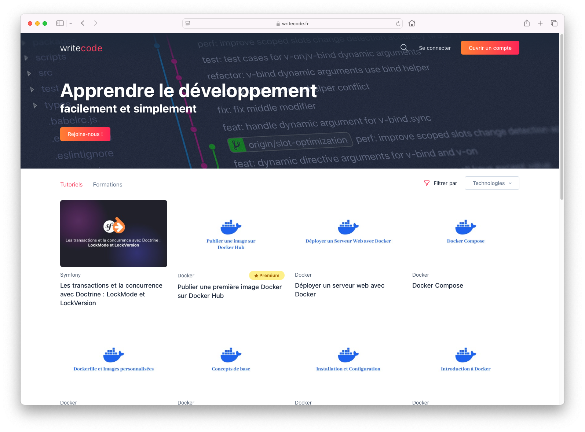

# WriteCode



## Installation locale avec Docker

**Attention ! Docker doit être installé sur la machine pour que les commandes ci-dessous puissent fonctionner**

Installer le projet en local via les commandes ci-dessous :

```bash
make dev # Permet de lancer le serveur de développement, accessible ensuite sur http://writecode.localhost:8080 ou http://localhost:8080
docker exec -it composer install # Permet d'installer les dépendances
docker exec -it composer require --working-dir=tools/php-cs-fixer friendsofphp/php-cs-fixer -W # Permet d'installer PHP-CS-Fixer
tools/php-cs-fixer/vendor/bin/php-cs-fixer fix src # Permet designer le dossier à fixer
make seed # Permet de remplir la base de données
docker exec -it yarn install # Permet d'installer les dépendances
docker exec -it yarn build # Permet de compiler les assets
docker exec -it php-fpm bin/console typesense:create # Permet de créer la base de données Typesense
docker exec -it php-fpm bin/console typesense:populate # Permet de remplir la base de données Typesense
```


En cas de développement frontend, penser à exécuter la commande suivante pour visualiser les changements apporter via CSS et/ou JS
```bash
make watch # Permet de lancer WebPack Encore en mode dev
```

Tester la qualité du code avant chaque commit
```bash
make lint # Permet de vérifier que le code ne contienne pas d'erreur
```

## Les services

Ces URLs sont disponibles seulement en mode développement

* Redis : http://writecode.localhost:8081
* PhpMyAdmin : http://writecode.localhost:8089


## Commandes disponibles

```bash
make dev # Démarre le serveur Docker
make deploy # Déploie une mise à jour du site sur le serveur
make seed # Remplis la BDD de données
make watch # Met en fonctionnement le serveur Webpack Encore en mode dev
make lint # Check la qualité du code
make install # Installe le projet en mode prod
```

## Base de données
Si la base de données ne s'est pas créée :

```bash
docker exec -it php-fpm bin/console doctrine:database:create
docker exec -it php-fpm bin/console make:migration
docker exec -it php-fpm bin/console doctrine:migration:migrate
```


# Résolution de problèmes

Donner les droits a ces dossiers dans le projet

```bash
sudo chmod 0777 -R /var/cache/
sudo chmod 0777 -R /var/log/
sudo chmod 0777 -R /var/storage/
```

Dans le dossier `public`, doit se trouver un dossier pour l'upload d'images

```bash
cd public
sudo mkdir uploads
cd uploads
sudo mkdir courses
sudo mkdir technologies
sudo mkdir trainings
cd ..
sudo chmod 0777 -R uploads
```

### En cas d'erreur 500 avec le message `Not Found`

Il se peut que le moteur Typesense ne soit pas peuplé de données

```bash
docker exec -it php-fpm bin/console typesense:create
docker exec -it php-fpm bin/console typesense:populate
```

### Configuration path "security.access_control" cannot be overwritten. You have to define all options for this path, and any of its sub-paths in one configuration section.

```bash
make install
docker-compose up -d
docker exec -it php-fpm bin/console typesense:create
docker exec -it php-fpm bin/console typesense:populate
```
